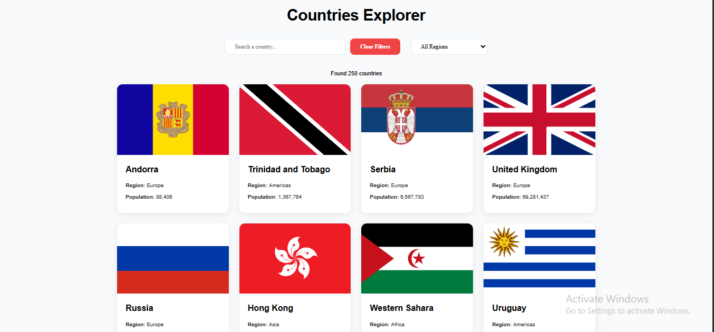
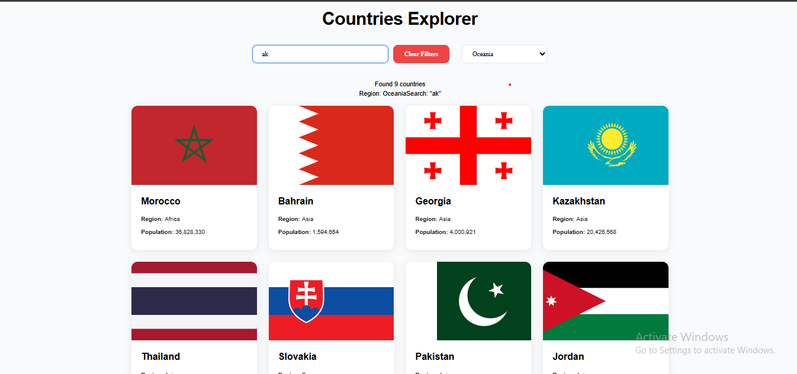
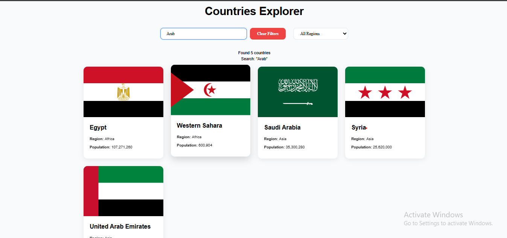

# 🌍 Countries Explorer

Countries Explorer is a React application that allows users to explore real-world country data using the **REST Countries API**.  
Users can search for countries by name, filter them by region, and view key information in a clean and responsive UI.

This project was built as part of the **Week 3 Assignment** and fulfills all mandatory requirements.

---

## 🎯 Objective

Build a Countries Explorer app that enables users to:

- Load real country data from an external API
- Search countries by name
- Filter countries by region
- Properly handle loading and error states
- Display country information in a user-friendly interface

---

## 🏗️ Project Structure

countries-explorer/
├── public/                 # Static files
├── src/                    # Source code
│   ├── components/         # React components
│   │   ├── SearchBar.js    # Search component with debounce
│   │   ├── RegionFilter.js # Region dropdown filter
│   │   ├── CountryList.js  # Countries grid display
│   │   └── CountryCard.js  # Individual country card
│   ├── App.js              # Main application component
│   ├── App.css             # Global styles
│   └── index.js            # Application entry point
├── README.md               # This file
└── package.json            # Dependencies and scripts

## 🚀 Features

- 🔍 Search countries by name with debounced input
- 🌍 Filter countries by region
- ⏳ Loading state while fetching data
- ❌ Error handling with retry functionality
- 🧹 Clear filters button
- 📊 Country cards displaying:
  - Flag
  - Country name
  - Region
  - Population
- 🧠 Safe rendering for missing or undefined data

---

## 🧰 Technologies Used

- React
  - `useState`
  - `useEffect`
- JavaScript (ES6+)
- Fetch API
- REST Countries API
- CSS (Custom styling)

---

## 🔌 API Used

**REST Countries API**  
(No API key required)

### Endpoints

- Get all countries:

https://restcountries.com/v3.1/all

- Search country by name:


https://restcountries.com/v3.1/name/{name}


- Filter countries by region:


https://restcountries.com/v3.1/region/{region}


---

## 🗂 State Management

The application uses the following state variables:

```js
countries   // array
loading     // boolean
error       // string | null
search      // string
region      // string (default: "all")

🧩 UI Controls

At the top of the page:

🔍 Search input for country name

🌍 Region dropdown with the following options:

All

Africa

Americas

Asia

Europe

Oceania

🧹 Clear Filters button

🔄 Fetch Logic

Data fetching is handled using useEffect:

On initial app load

When the search value changes

When the region value changes

useEffect(() => {
  // fetch logic
}, [search, region]);

Notes:

Search requests are triggered only when the search text length is 2 or more characters

Debouncing is used to reduce unnecessary API calls

⏳ Loading & ❌ Error Handling

Loading state

Displays: Loading Countries...

Error state

Displays error message

Provides a Retry button to re-fetch data

🗃 Countries List UI

Each country is displayed as a card showing:

Flag image

Country name

Region

Population (formatted for readability)

Example:
🇩🇪 Germany
Region: Europe
Population: 83,000,000

⭐ Bonus Features Implemented

✅ Debounced search (500ms delay)

✅ “No results found” UI

✅ Clear filters button

⚠️ Rules Compliance

❌ No data fetching inside the render body

✅ Proper loading and error handling

✅ Correct usage of key when mapping components

✅ Application does not crash if some country fields are missing

🛠 How to Run the Project

Clone the repository:

git clone <repository-url>


Install dependencies:

npm install


Start the development server:

Run the Project
npm run dev 


Open in browser:

http://localhost:3000

📸 Screenshots

🏠 Home page (initial state)



📋 Results page (after search or region filter)




👤 Author

Amena_Miri
Countries Explorer
Week 3 Assignment — React